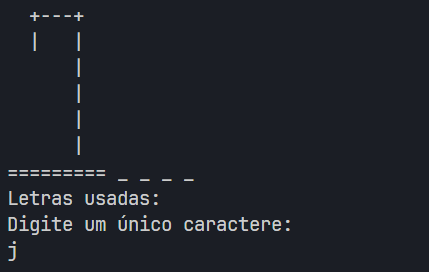
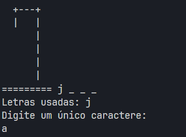
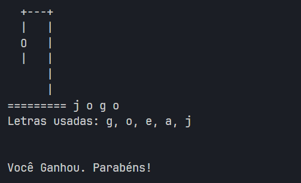
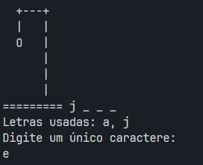
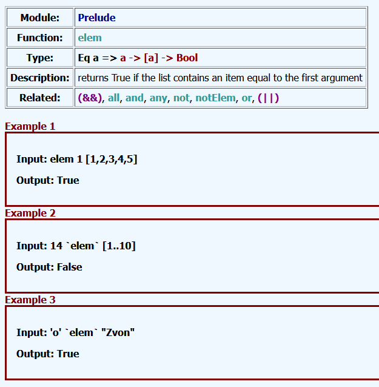

# Jogo da Forca

**Disciplina**: FGA0210 - PARADIGMAS DE PROGRAMAÇÃO - T01 <br>
**Nro do Grupo**: 05<br>
**Paradigma**: FUNCIONAL<br>

## Alunos
|Matrícula | Aluno |
| -- | -- |
| 18/0015311 |  Danilo Domingo |
| 19/0030291 |  Jackes Fonseca |
| 20/0021541 |  Karla Chaiane  |
| 18/0042661 | Luís Furtado de Araújo |
| 20/0023748 | Marcos Bittar |
| 19/0020814 |  Vinícius Roriz |

## Sobre 
Esta é uma implementação em Haskell do clássico jogo da forca, onde o jogador tenta adivinhar uma palavra escondida, letra por letra, dentro de um número limitado de tentativas.

O progama escolhe uma palavra e mostra a quantidade de letras representadas por "_". O jogador então tem 6 tentativas para acertar todas as letras da palavra, com cada tentativa errada adicionando uma parte do corpo ao boneco na forca, que é exibida pelo programa.

## Screenshots
 
 
 

## Instalação 
**Linguagens**: Haskell<br>
**Tecnologias**: Cabal<br>

1. Instale o GHCup e suas dependências:
#### Linux / WSL
```
curl --proto '=https' --tlsv1.2 -sSf https://get-ghcup.haskell.org | sh
```
- Quando questionado, escolha sempre as opções padrão
#### Windows (PowerShell Não Admin)
```
Set-ExecutionPolicy Bypass -Scope Process -Force;[System.Net.ServicePointManager]::SecurityProtocol = [System.Net.ServicePointManager]::SecurityProtocol -bor 3072; try { & ([ScriptBlock]::Create((Invoke-WebRequest https://www.haskell.org/ghcup/sh/bootstrap-haskell.ps1 -UseBasicParsing))) -Interactive -DisableCurl } catch { Write-Error $_ }
```
2. Compile e execute o projeto:
```
cabal run
```

## Uso 
Ao executar o projeto, o programa escolherá uma palavra e mostrará traços representando a quantidade de letras. O jogador pode então digitar um caractere (deve ser uma letra do alfabeto, não importando se maiúscula ou minúscula). Caso seja digitado mais de um caractere, só o primeiro será reconhecido.  
  

O programa irá gerar outra forca com o novo estado do jogo, substituindo traços quando o caractere sugerido pelo jogador se encaixar naquela posição na palavra.
  

Quando o jogador errar seu palpite, uma nova parte do boneco será gerada na forca, e o jogo acaba se o boneco ficar completo, portanto o jogador tem 6 tentativas.
  

Ao acertar todas as letras, o jogo se encerra na vitória do jogador.  


## Vídeo
Adicione 1 ou mais vídeos com a execução do projeto.
Procure: 
(i) Introduzir o projeto;
(ii) Mostrar passo a passo o código, explicando-o, e deixando claro o que é de terceiros, e o que é contribuição real da equipe;
(iii) Apresentar particularidades do Paradigma, da Linguagem, e das Tecnologias, e
(iV) Apresentar lições aprendidas, contribuições, pendências, e ideias para trabalhos futuros.
OBS: TODOS DEVEM PARTICIPAR, CONFERINDO PONTOS DE VISTA.
TEMPO: +/- 15min

## Participações
Apresente, brevemente, como cada membro do grupo contribuiu para o projeto.
|Nome do Membro | Contribuição | Significância da Contribuição para o Projeto (Excelente/Boa/Regular/Ruim/Nula) | Comprobatórios (ex. links para commits)
| -- | -- | -- | -- |
| Jackes  |  Programação da funcionalidade de sugerir palavra aleatória, revisão de Pull Request | Boa | Commit tal (com link)
| Vinícius  | Planejamento, organização, revisão, módulos GameLogic e GameState   | Excelente | [GameLogic](https://github.com/UnBParadigmas2024-2/2024.2_G5_Funcional_Forca/pull/3/commits/4db715fe5cce61b0e88f29d57597003eb0f36903), [GameState](https://github.com/UnBParadigmas2024-2/2024.2_G5_Funcional_Forca/commit/4fbf7d9ac3055c3ceae8a45bee42c56b909c486b)
| Luís Fernando Furtado de Araújo  | Desenvolvimento da main do programa (lógicas do loop do jogo, tomadas de decisão e chamada das funções), Resolução do bug de incompatibilidade da biblioteca 'base' com a versão instalada do GHC | Excelente | [Resolução Bug lib base <-> versão GHC](https://github.com/UnBParadigmas2024-2/2024.2_G5_Funcional_Forca/commit/dd9a0173d9864e5b32d7a89da9165cb6d3aee6dc), [Lógicas da main](https://github.com/UnBParadigmas2024-2/2024.2_G5_Funcional_Forca/commit/370eb743ee3ad090584879e23094cd92a0b8b79b), [Finalização da main](https://github.com/UnBParadigmas2024-2/2024.2_G5_Funcional_Forca/commit/4c58bdca7327309cbaa962f88df8d3469591cea3#diff-d3e498a88b4c374b1edbd8693542a73e944d51a24a64a683658926ba655bc6ffR39)

## Outros 
**I. Lições Aprendidas:**

Esse projeto nos desafiou a sair da mentalidade das linguagens imperativas, e mergulhar no paradigma funcional. Uma das primeiras lições foi compreender a imutabilidade do estado, que em Haskell é tratada através de funções puras e valores de retorno, em vez de variáveis mutáveis.  
Esse conceito mudou a abordagem para gerenciar o estado do jogo, exigindo a passagem contínua de valores atualizados, como a lista de letras adivinhadas e o número de vidas, sem modificar diretamente o estado original.  
Aprender a utilizar IO para manipular entradas e saídas foi fundamental para balancear a pureza funcional com as necessidades de interação do jogo.  

**II. Percepções:**

Um dos pontos fortes do paradigma é a modularização, que nos proporcionou dividir a carga de trabalho entre os integrantes e depois unir os módulos criados com pouca dificuldade, já que as entradas e saídas já estavam claramente definidas.  
A criação de funções pequenas e compostas reforçou uma abordagem declarativa, tornando o código mais legível e fácil de manter.  
Esse projeto destacou a eficiência de Haskell em problemas que exigem uma lógica clara e concisa, enquanto promoveu uma mentalidade funcional focada em composição, modularidade e previsibilidade do comportamento do programa.

**III. Contribuições e Fragilidades:**

Uma grande contribuição do modelo de separação por módulos foi a clara divisão de responsabilidades, que permitiu que cada pessoa focasse em uma área específica, como lógica do jogo, gerenciamento de estado, renderização e escolha de palavras, aprofundando o conhecimento sobre o funcionamento e as melhores práticas do Haskell em cada domínio. 

No entanto, a divisão por módulos também trouxe fragilidades, principalmente em relação à comunicação e à coesão do projeto. Como cada módulo foi desenvolvido separadamente, houve desafios para garantir que todos mantivessem a mesma visão de como o jogo deveria funcionar.  
Erros de integração surgiram, o que resultou em ajustes de última hora e retrabalho. Outro ponto sensível foi a gestão de tempo e interdependência entre os módulos, pois alguns integrantes precisaram esperar a conclusão de outros módulos antes de prosseguir, o que atrasou o fluxo de desenvolvimento em certos momentos.

**IV. Trabalhos Futuros:**

Para futuros trabalhos, há várias melhorias e expansões que poderiam ser implementadas neste projeto. Como a estrutura modular do código atual facilita a adição de novas funcionalidades, poderiam facilmente serem desenvolvidos módulos separados sem interferir na lógica principal, uma abordagem interessante seria aumentar a interatividade, por exemplo, permitindo diferentes níveis de dificuldade ou categorias temáticas de palavras, ou até mesmo um sistema de dicas para o jogador.  
Também seria útil considerar uma migração para uma interface gráfica, usando bibliotecas como Gloss ou Brick, que tornariam o jogo mais visualmente atraente, mas que eram complexas demais para serem aprendidas nesse curto período de tempo.

## Fontes
### [Zvon](http://www.zvon.org/other/haskell/Outputglobal/index.html)
Zvon é um site que possui informações sobre várias funções e módulos da linguagem Haskell, apresentadas de forma concisa e com exemplos.  


Sugestão de leitura: 
*Effective Haskell*. Rebecca Skinner, 2023
